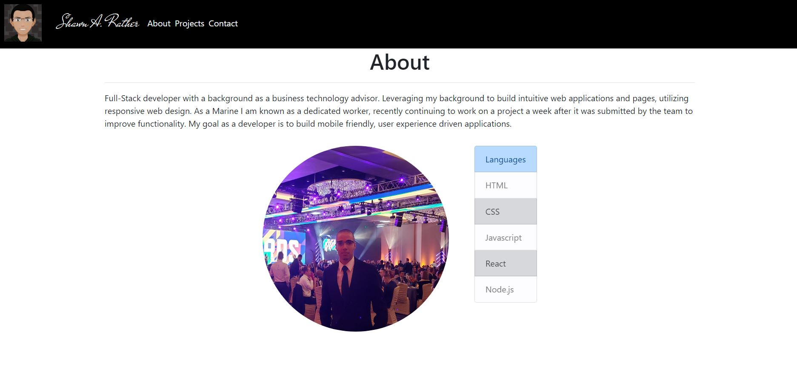
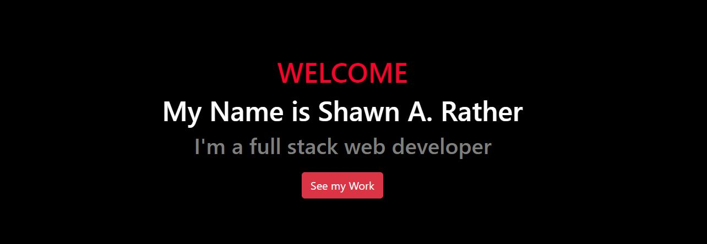

# My Portfolio

## Table of Contents
- [Description](#descriptiongo)
- [Installation Instructions](#installgo)
- [Usage](#usagego)
- [How to Contribute](#contrigo)
- [Authors](#authorgo)
- [How to Run Tests](#testsgo)
- [Deployed Links](#deployedgo)
- [Questions](#contactgo)
        
## Description

Portfolio page created with React.Js

## Installation Instructions

React.JS
## Usage

React page showcasing my projects and desgin skills
## License

MIT License
## Contribution Guidelines

## Authors

Shawn A. Rather
## Tests

## Deployed

https://shawn-rather-portfolio.herokuapp.com/
## Questions

Refer to github or send email with any questions:

SAR-SA

sarsa.web@gmail.com
